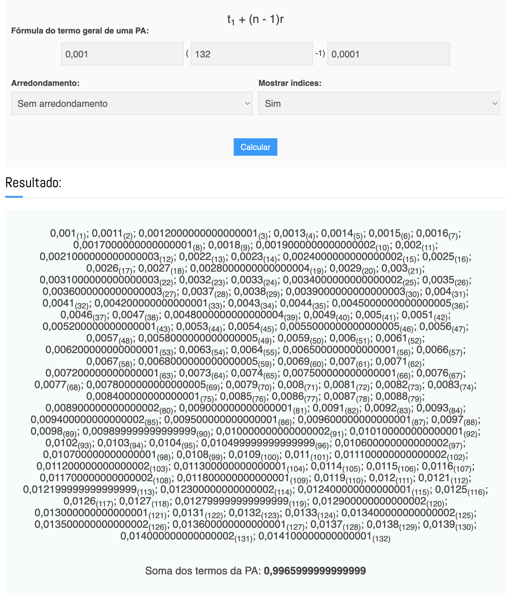
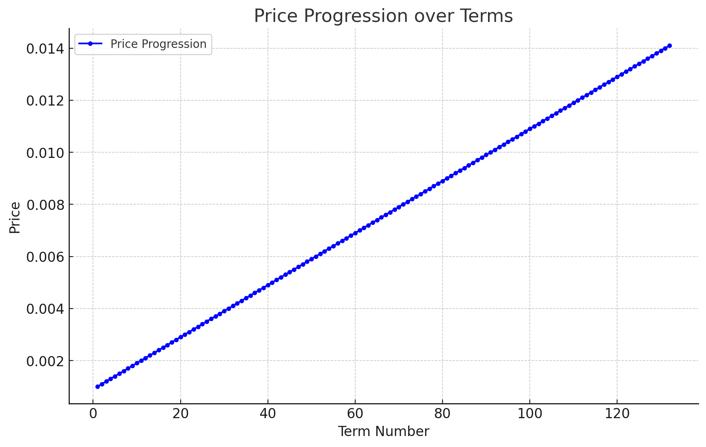

# Token Vendor Machine Challenge

This project is designed to test your skills in smart contract development using Solidity.

## Project Overview

You are tasked with implementing a token vendor machine that allows users to buy and sell tokens. The project consists
of two main contracts:

1. `BlockfulToken.sol`: An ERC20 token contract
2. `TokenVendor.sol`: A vendor contract for buying and selling tokens

## Getting Started

To get started with this project, follow these steps:

1. Clone this repository.
2. Run `yarn install` to install dependencies.

## Usage

Here are some common commands you'll need:

### Build

```sh
yarn build
```

### Test

```sh
yarn test
```

### Coverage

```sh
yarn coverage
```

## Design Decisions and Implementation Details

### Merkle Tree Whitelist

I chose to implement a Merkle tree-based whitelist for the following reasons:

1. Gas Efficiency: Merkle trees are highly gas-efficient for large whitelists, as users only need to provide a small
   proof instead of storing the entire whitelist on-chain.
2. Scalability: Merkle trees can handle large whitelists without significant increase in gas costs or storage
   requirements.
3. Flexibility: The whitelist can be easily updated off-chain without modifying the contract, only the merkle root needs
   to be updated.

Other approaches considered:

- On-chain mapping of addresses
  - Which are simple but can be expensive for large whitelists.
- Signature-based whitelisting
  - Which move the whitelist off-chain but require careful key management.

### Dynamic Pricing Mechanism

The contract uses arithmetic progression to model dynamic pricing. For buying, it solves a quadratic equation derived
from the sum of an arithmetic sequence, where the progression represents increasing token prices. This calculates the
maximum number of tokens purchasable with a given ETH amount. For selling, it applies the arithmetic progression sum
formula directly. It calculates the first term (current price) and last term (price after selling) of the progression,
then uses these to compute the total ETH amount received for selling a specific number of tokens. Both functions account
for remaining supply and scale results appropriately for ETH decimals.

Using a online calculator, I was able to verify the formulas:

- [Arithmetic Progression Calculator](https://www.calculadoraonline.com.br/progressao-aritmetica)

We can see with the current params of the contract, 1 ether should be able to buy 132 tokens. And if we sell 132 tokens,
we should receive 0.9966 ether.



### Price Calculation Visualization

The dynamic pricing mechanism can be visualized as follows:



This graph illustrates how the token price increases as more tokens are sold, following the arithmetic progression
defined in the contract.

### Timed Sales

The contract implements two sale phases:

1. Whitelist Sale: Only whitelisted addresses can participate.
2. Public Sale: Open to all participants.

This allows for a fair distribution of tokens and prioritizes early supporters.

### Testnet Deployment

The contracts have been deployed to Base Sepolia testnet:

- TokenVendor:
  [0x41d0295a3d569ce352005c74a779d15a1a20026d](https://sepolia.basescan.org/address/0x41d0295a3d569ce352005c74a779d15a1a20026d)
- BlockfulToken:
  [0x2fb7decc8dece6b2f79e24cc836d0029b3500a62](https://sepolia.basescan.org/address/0x2fb7decc8dece6b2f79e24cc836d0029b3500a62)

### Generate Merkle Proof

A script has been created to generate Merkle proofs for whitelisted addresses. It could be improved by reading and
writing to files. You can run it using:

```sh
yarn run generate-merkle-proof
```

Example output:

```
== Logs ==
  Merkle Root:
  0x63aebfd6c25f7cb1c061ae0e47e2f791805738b05d65798948a074772fdb2dc5
  Proof for address 0x97CcF8F927045E4C5f936832d14904A68e595380
  0x05d950397ccecc95c775a4c4011d79412941ab20aa08cc5522707bb4a8f612e8

  Proof for address 0x6B2760f5C87add9d2f2AB99bb0F3afEF8ec27B42
  0x87c8b8393ee586832bdaa693790b61a49e0eb54a2f6181524d8aee9f4d880b9a
```

## Testing

General tests have been conducted to ensure the proper functioning of the contracts. For more details, refer to the test
files in the `test/` directory.

### Coverage

Only `fallback` method not tested.

| File                | % Lines        | % Statements    | % Branches     | % Funcs        |
| ------------------- | -------------- | --------------- | -------------- | -------------- |
| src/TokenVendor.sol | 98.21% (55/56) | 98.00% (98/100) | 95.83% (23/24) | 91.67% (11/12) |

## Possible Improvements

The current dynamic pricing mechanism could be enhanced by implementing a more sophisticated Automated Market Maker
(AMM) model similar to decentralized exchanges. This approach would use the constant product formula (x \* y = k) to
determine token prices based on the current reserves. It would provide more efficient and responsive pricing, improved
market depth, and reduced price impact for larger trades. However, implementing this would require significant changes
to the contract structure and introduce new considerations like complex mathematical models and potential arbitrage
opportunities.

### Security Measures

- ReentrancyGuard: Prevents reentrancy attacks.
- Ownable: Restricts certain functions to the contract owner.
- Pausable: Allows pausing the contract in case of emergencies.
- SafeERC20: Ensures safe token transfers.

## Your Tasks

1. Review the implementation of `BlockfulToken` and `TokenVendor` contracts.
2. Complete the test file `test/TokenVendor.t.sol`:
   - Add more edge cases and potential failure scenarios.
   - Aim for at least 90% test coverage.
3. Update the deployment script if necessary.
4. Consider any potential improvements or considerations for a real-world deployment.

## Evaluation Criteria

Your submission will be evaluated based on:

- Correctness of the implementation
- Code quality and organization
- Test coverage and quality
- Security considerations
- Testnet deployment
- Documentation and comments
- (For bonus tasks) Creativity and effectiveness of additional features

## Submission

Please submit your completed project as a Git repository. Make sure to include:

- All source code files
- Complete test suite
- Updated README with your notes and explanations

## Note

This project uses [Foundry](https://getfoundry.sh/). If you're new to Foundry, check out the
[Foundry Book](https://book.getfoundry.sh/) for detailed instructions and tutorials.

Good luck with the challenge! We're excited to see your implementation.
